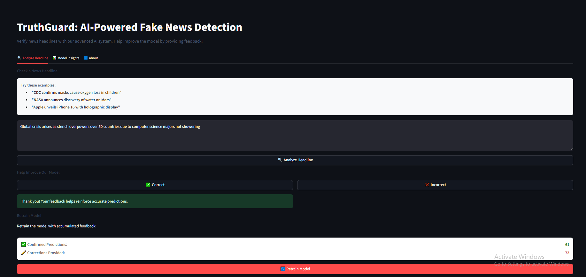
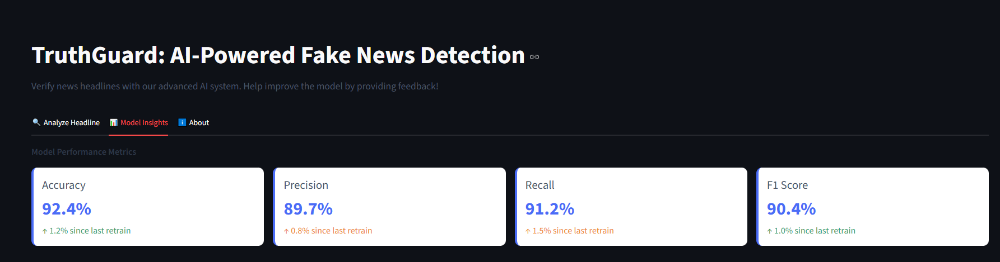

# 📰 TruthGuard: AI-Powered Fake News Detection

[](https://truthguard.streamlit.app)
[](https://github.com/Ibrahim5570/truthguard)




TruthGuard is an AI-powered tool that helps users verify news headlines and combat misinformation. By leveraging machine learning, it analyzes linguistic patterns to identify potentially fake news with user feedback to continuously improve accuracy.

## ✨ Features

- 🔍 Real-time headline analysis with confidence scoring
- 📊 Visual model performance metrics and insights
- 💬 User feedback system to correct mistakes
- 🔄 One-click model retraining with new feedback
- 📈 Performance tracking across retraining cycles
- 🌐 Intuitive, user-friendly interface

## 🚀 Try It Live

[Try it HERE!](https://truthguard-ibrahim5570.streamlit.app)

## 🖥️ Run Locally

### Installation
```bash
# Clone the repository
git clone https://github.com/yourusername/truthguard.git
cd truthguard

# Create and activate virtual environment
python -m venv venv
source venv/bin/activate  # Linux/MacOS
venv\Scripts\activate    # Windows

# Install dependencies
pip install -r requirements.txt

# Download the pre-trained model (or train your own)
# [Add instructions for obtaining model files]
```
# Running the Application
```bash
  streamlit run app.py
```
    The app will automatically open in your default web browser at http://localhost:8501.

# 🤝 How to Contribute

## We welcome contributions! Here's how you can help:

* Report issues: Found a bug? Please open an issue with details.
* Suggest features: Have an idea to improve TruthGuard? Create a feature request .
* Contribute code:
* Fork the repository
* Create your feature branch (git checkout -b feature/AmazingFeature)
* Commit your changes (git commit -m 'Add some AmazingFeature')
* Push to the branch (git push origin feature/AmazingFeature)
* Open a Pull Request

# 📦 Project Structure
TruthGuard/

├── app.py

├── train.py

├── requirements.txt

├── models/

│   ├── fake_news_model.pth

│   └── tfidf_vectorizer.pkl

├── data/

│   ├── feedback.jsonl

│   └── correct_predictions.jsonl

├── notebooks/

│   ├── predict.ipynb

│   ├── app.ipynb

│   └── train.ipynb

└── README.md 


# 📈 Why This Matters
## Fake news spreads faster than facts. This project aims to:

* 🔍 Help users think critically about headlines
* 🛠 Build a transparent, explainable AI (no black boxes)
* 🔄 Create a self-learning system that improves with use
* 🎯 Promote media literacy in the age of misinformation
---
# 📄 License
## MIT License

---

# Author 

## Ibrahim Abdullah

---

# Dataset
---
### FakeNewsNet.csv (from Kaggle)

---

# Connect with me
---
[](https://github.com/Ibrahim5570)

[](https://www.linkedin.com/in/ibrahim-abdullah-220917319)


